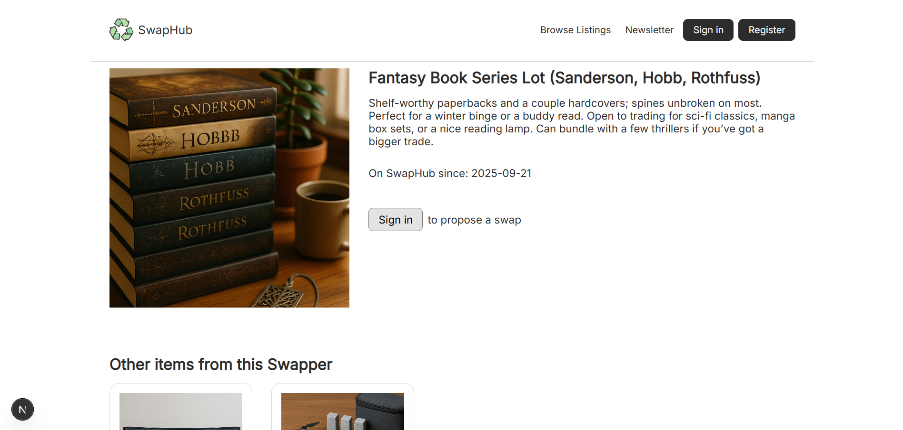

# Dokumentation for Swaphub web applicatiom
Emma Lindekilde Larsen, WU12

Jeg har lavet valgfri opgave C



## Kom i gang
`npm install zod react-icons`

`npm install --save-dev sass`

`npm run dev`

## Tech-stack
* **React**  
React er et open source front-end JavaScript bibliotek, hvor jeg kan bygge user interfaces baseret på komponenter.  
React har god state-håndtering og indbyggede funktioner, der kaldes hooks.  
Med React kan jeg nøjes med at opdatere de dele af DOM'en, der ændrer sig, når data ændrer sig. Dermed kan jeg undgå genindlæsning af hele DOM'en.  
Jeg kunne også have valgt at bruge Svelte, som er et open source front-end framework. Svelte er mindre udbredt end React og har et mindre udvikler community.  
Der er derfor større mulighed for support ved brug af React.  
Med React får jeg desuden mulighed for server-side rendering, når jeg bruger det sammen med frameworket Next.js.

* **Next.js**  
Next.js er et open source front-end framework baseret på React.  
Next giver mulighed for mappebaseret routing samt rendering af komponenter og funktioner på serveren.  
Et andet framework, jeg kunne have brugt, er Vue.js. Vue giver mulighed for automatisk at opdatere web appens indhold når dataen forandres.  
Jeg har valgt at bruge Next frem for Vue, da jeg med Next får mulighed for at server-rendere komponenter og funktioner, der ikke modtager input fra brugeren.  
Server-rendering er en fordel fordi det giver højere sikkerhed at afvikle funkltionalitet på serveren fremfor i klienten.  
Det giver også lavere indlæsningstid for brugeren når en del af indholdet renderes på serveren frem for på deres device.  
Next komplimenterer React godt, da React renderer indhold i klienten.

* **Zod**  
Zod er et valideringsbibliotek, der virker med TypeScript og JavaScript.  
Med Zod kan jeg definere skemaer, jeg kan bruge til at validere forskellige datatyper, eksempelvis strings og emails.  
Zod har et regEx, der tjekker emailens struktur og tager højde for specialtegn som eksempelvis æ, ø, å.

* **React-icons**  
React-icons er et bibliotek, der giver mig adgang til de fleste større open source ikonbiblioteker, f.eks. Font Awesome.  
Med react-icons kan jeg nemt importere forskellige svg ikoner og bruge dem i min app.

* **SASS**  
SASS (syntactically awesome style sheets) er et extension language, som tillader mig bl.a. at lave nestede stylingregler.  
Det er smart fordi jeg skal skrive færre tegn for at style underliggende elementer, når jeg f.eks. bruger BEM-navngivning.  
BEM er en navngivningskonvention, hvor DOM'en inddeles i blokke, som gives et navn.  
Blokkene kan inddeles i elementer, som også gives et navn og igen i modifiers, som gives et navn.  
Konventionen er at skrive block__element--modifier, og denne syntax virker godt sammen med den nesting, jeg kan lave i reglerne, når jeg bruger SASS.  
CSS giver ikke mulighed for nesting, og derfor har jeg valgt at bruge SASS.  
En anden mulighed havde været at bruge Tailwind CSS, men på nuværende tidspunkt er jeg mest fortrolig med SASS og har derfor valgt at holde mig til det.

* **Git**  
Git er et versionsstyringsværktøj, hvor jeg kan lave branches og versioner af min kode.  
Med Git kan jeg gå tilbage til tidligere versioner, hvis jeg f.eks. har lavet en ændring, jeg gerne vil fortryde.  
Jeg bruger Git sammen med GitHub, en hosting platform, der implementerer Git.

* **Swaphub API**  
Et API er et sæt af regler, som medierer kommunikationen mellem forskellige software applikationer, eksempelvis en klient og en server.  
I denne applikation sender jeg http-requests til Swaphub API'et, nogle gange sammen med en access token, og API'et sender den relevante data tilbage til mig.  
Jeg kan derefter vise dataen på siden eller bruge den til anden relevant funktionalitet i web appen.

## Kodeeksempel
Listing detaljer, underside  
fil:  
listing/[id]/page.jsx
```jsx
import { getAllListings, getSingleListing } from "@/utilities/get-data";
import { notFound } from "next/navigation";

// Jeg har fjernet noget kode her for at få en nogenlunde passende længde på mit kodeeksempel

export async function generateMetadata({ params }) {
    
    const {id} = await params;
    const data = await getSingleListing(id);
    
    return {
        title: data?.title
    }
}

export default async function listingDetailsPage({ params }) {
    
    const {id} = await params;
    const listingData = await getSingleListing(id);
    const allListingsData = await getAllListings();
    let accessTokenExpired = false;

    // Jeg har fjernet noget mere kode her for at få en nogenlunde passende længde på mit kodeeksempel

    if (!listingData) {
        notFound();
    }
    
    // Jeg har fjernet noget mere kode her for at få en nogenlunde passende længde på mit kodeeksempel
}
```
Jeg vil gerne fortælle om undersiden, der viser detaljerne for en enkelt listing.  
Jeg har udeladt dele af koden for at få en nogenlunde passende længde på mit kodeeksempel

* **Dynamisk url:**  
Jeg har valgt at siden skal have url strukturen domæne/listing/[id], hvor [id] er id'et for den listing eller genstand, der bliver vist på detaljesiden.  
Url'en er altså dynamisk, og bliver genereret ud fra hvilken værdi, der sendes med i linket, som viser hen til detaljesiden.  
Jeg har kaldt indholdet af sluggen i mappestrukturen for id fordi det er id'et jeg sender med i url'en.  
Id'et sendes med i url'en fordi jeg skal bruge det til at hente data om genstanden fra Swaphub api'et.

* **Asynkrone funktioner og params:**  
På listing detaljesiden har jeg to asynkrone funktioner, generateMetadata() og listingDetailsPage().  
De er asynkrone fordi de indeholder funktionalitet, der skal hente noget data fra et andet sted.  
I dette tilfælde hentes data både fra url'en via params og fra api'et.   
Brugen af keywordet async ved deklarering af funktionerne tillader at vi i funktionerne kan bruge keywordet await de steder, hvor vi skal hente data asynkront.

* **generateMetadata funktionen:**  
generateMetadata er en indbygget funktion i next.js, som bruges til at dynamisk at generere metadata baseret på dynamisk information.  
Metadataen bruger jeg her til at vise genstandens titel på browsertabben.  
Jeg skal bruge genstandens id til at fetche data om genstanden, herunder dens titel.  
Jeg finder id'et, som jeg har i url'en, ved at destrukturere funktionens props objekt og hente property'en params ud.  
Jeg kan finde id'et som en property i params fordi params indeholder url-strukturen og jeg har kaldt den dynamiske del id i min mappestruktur.  
Når jeg har hentet id'et ud kan jeg bruge det til at fetche genstandens detaljer fra api'et.  
Jeg har skrevet min fetch funktion i en anden fil, som jeg importerer.  
Jeg sætter sidens titel til genstandens navn og returnerer dette fra generateMetadata funktionen.  
Den dynamisk genererede titel bliver modtaget i layout.jsx-filen, som sætter den ind i et mønster, jeg har defineret der.

* **listingDetailsPage funktionen: fetches og variabler:**  
Jeg kan lave denne funktion asynkron fordi jeg med Next har valgt at rendere denne page-component på serveren.  
I listingDetailsPage funktionen finder jeg igen genstandens id vha. params og fetcher data om genstanden fra api'et.  
Jeg fetcher også data om alle aktiviteter vha. en fetch funktion, som ligger i en anden fil, jeg importerer.  
Jeg gemmer dataen i to variabler, listingData og allListingsData.  
Jeg deklarerer de to variabler med keywordet const fordi de ikke skal kunne assignes nye værdier senere i koden.  
Jeg deklarerer desuden en variabel, accessTokenExpired, der skal holde styr på om brugerens access token er udløbet og sætter den til boolean-værdien false.  
Jeg deklarerer den med keywordet let for at kunne overskrive den senere.

* **notFound():**  
Inden jeg går videre med anden funktionalitet, laver jeg et check på, om fetchet af listingData er gået godt.  
Jeg bruger en guard clause, en betinget sætning, hvor jeg tjekker om det er sandt, at dataen ikke findes.  
Hvis betingelsen om, at dataen ikke findes, er sand, kalder jeg den indbyggede next-funktion notFound(), som importeres fra next/navigation.  
Denne funktion stopper resten af koden i funktionen og kører i stedet den kode, jeg har gemt i filen not-found.jsx.  
På denne måde kan jeg sikre mig, at genstandens detaljeside kun vises, hvis jeg faktisk har adgang til data om genstandens detaljer.  

### Referencer
Jeg har brugt følgende internet opslag til sammenligning af biblioteker og frameworks:
* **Next.js vs Vue.js:**
https://dev.to/dominion_olonilebi_9dd01d/nextjs-vs-vuejs-in-depth-comparative-study-1na

* **React vs Svelte:**
https://www.geeksforgeeks.org/blogs/react-vs-svelte/